# Texture mapping for lookup

All used in game textures and corresponding ID in maps is displayed in table below. Texture without ID means that it is not used in map creation but is avaible in img folder.

| ID | Name | Size | Image | More than one frame?|
|-|-|-|-|-|
|0|AIR|-|-| No|
|1|Dirt|32x32| 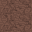|No|
|2|Dirt with grass|32x32| 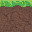|No|
|3|Ant|32x16| 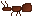| Yes (2) |
|4|Blue block|32x32| |No|
|4|Blue dirt block|32x32| 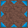|No|
|-|Red grass block|32x32| 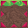|No|
|5|Red block|32x32||No|
|4|Red dirt block|32x32| 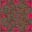|No|
|-|Red grass block|32x32| |No|
|6|Blank Barrier|32x32||No|
|-|Blank Barrier Visible|32x32||No|
|8|Blue switch|32x32|| Yes (2)|
|9|Red switch|32x32|| Yes (2)|
|-|Juke|54x32|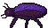| Yes (2)|
|-|Juke|54x48|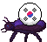| Yes (2)|
|-|Ball|32x32||No|
|-|Lamp|32x32|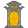|No|
|-|Grass|32x32||No|
|-|Sand|32x32|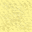|No|
|-|Stone|32x32|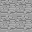|No|
|-|Start Tent|64x32||No|
|-|End Plane|64x32|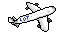|No|
|7|Title|64x32|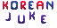|No|
|-|Start button|16x16||No|
|-|Exit button|16x16||No|
|-|Help button|16x16||No|
|-|Background 1|120x80|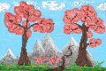|No|
